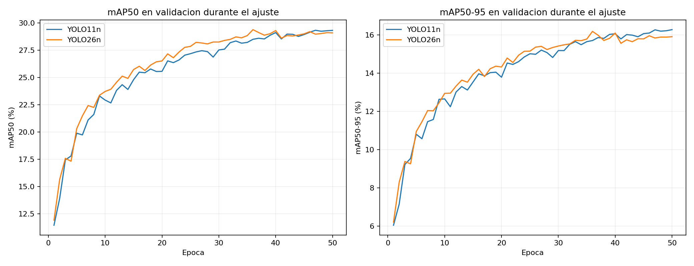
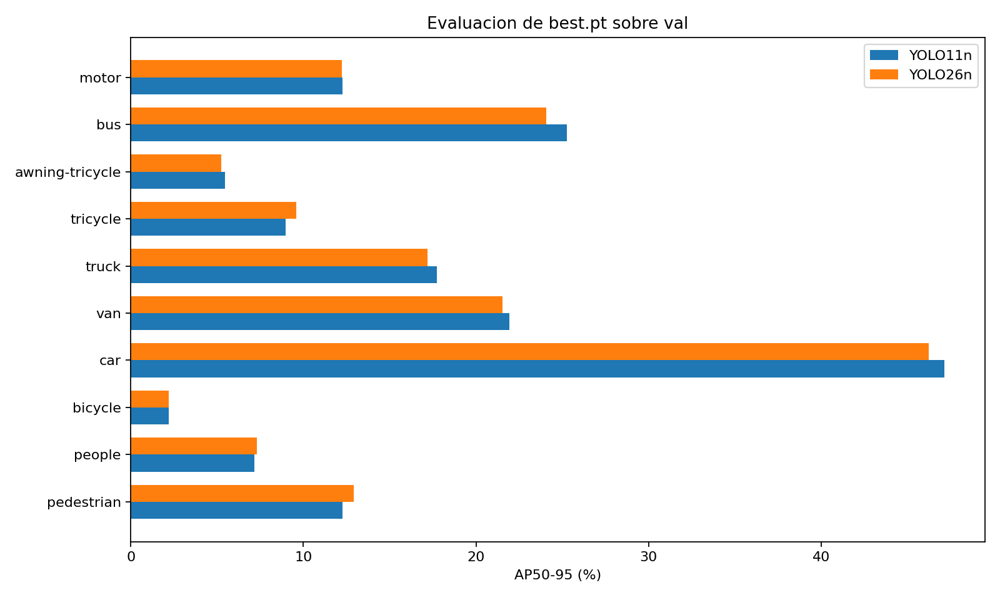

# Comparacion YOLO11n y YOLO26n en VisDrone

Resultados de validacion de best.pt. Una ejecucion por modelo, semilla 42; 50 epocas, 640 px, batch 4, workers 0. Mismos splits y versiones de software. Las diferencias no establecen significancia estadistica.

| Metrica | YOLO11n | YOLO26n | Delta 26 - 11 (pp) |
|---|---:|---:|---:|
| Precision | 41.88% | 40.41% | -1.47 |
| Recall | 31.38% | 31.77% | +0.39 |
| mAP50 | 28.41% | 28.45% | +0.04 |
| mAP50-95 | 16.03% | 15.85% | -0.18 |

| Clase | AP50-95 YOLO11 | AP50-95 YOLO26 | Delta (pp) |
|---|---:|---:|---:|
| pedestrian | 12.28% | 12.93% | +0.65 |
| people | 7.14% | 7.32% | +0.17 |
| bicycle | 2.18% | 2.20% | +0.02 |
| car | 47.14% | 46.23% | -0.92 |
| van | 21.92% | 21.53% | -0.39 |
| truck | 17.73% | 17.21% | -0.52 |
| tricycle | 8.96% | 9.59% | +0.63 |
| awning-tricycle | 5.44% | 5.23% | -0.21 |
| bus | 25.28% | 24.09% | -1.19 |
| motor | 12.25% | 12.22% | -0.03 |

## Interpretacion

El rendimiento global es muy similar. YOLO11 presenta una ventaja descriptiva de 0,18 puntos en mAP50-95; YOLO26 gana solo 0,04 puntos en mAP50. No hay evidencia de una mejora global de YOLO26 en este experimento.

YOLO26 mejora AP50-95 para pedestrian (+0,65 pp) y tricycle (+0,63 pp); YOLO11 obtiene mas AP en bus (+1,19 pp), car (+0,92 pp) y truck (+0,52 pp). Car es la clase mas fuerte de ambos (~46-47% AP50-95); bicycle (~2,2%), awning-tricycle (~5,3%) y people (~7,2%) son las mas debiles.

Las curvas mejoran con fuerza al principio y se aplanan hacia las epocas 35-40. El maximo del CSV de YOLO11 esta en la epoca 50 (16,28%); el de YOLO26, en la 36 (16,19%), frente a 15,91% en la 50. La leve caida de YOLO26 no basta para afirmar sobreajuste severo. No se comparan magnitudes de loss entre arquitecturas: emplean componentes diferentes (DFL frente a L1).

Las cifras del CSV describen validaciones internas durante el ajuste; la tabla principal usa la evaluacion independiente de best.pt registrada en run.json. No son exactamente iguales: la causa no ha sido aislada. No se mezclan ambos protocolos para decidir un ganador.

## Tiempo y muestra visual

- YOLO11n: 3.27 h totales; 26.59 ms/imagen. Muestra: TP=263, FP=192, FN=608.
- YOLO26n: 4.41 h totales; 26.74 ms/imagen. Muestra: TP=251, FP=151, FN=620.

YOLO26 requirio un 34,9% mas de tiempo total. Sus 51 registros de vista previa suman solo 10,33 s: no explican la diferencia de aproximadamente 68 minutos. El tiempo incluye entrenamiento y evaluaciones; no es una medicion aislada de la arquitectura.

Latencia medida secuencialmente en RTX 5070 Laptop: predict completo, 640 px, batch 1, una misma imagen de val, 5 calentamientos y 20 repeticiones. La diferencia de 0,15 ms es demasiado pequena para sostener una ventaja de velocidad; faltan repeticiones y escenas diversas.

La galeria usa las mismas primeras 8 imagenes de val, 871 objetos anotados, confianza 0,25 e IoU 0,5. YOLO26 reduce FP de 192 a 151, pero aumenta FN de 608 a 620. Son escenas relacionadas y no una muestra representativa aleatoria. Los umbrales de esta auditoria no equivalen necesariamente al punto operativo de precision/recall global.

La inspeccion visual muestra numerosas omisiones de personas y objetos pequenos en escenas densas, y falsas detecciones en vehiculos/vegetacion. Esto es una observacion cualitativa; no se calcularon AP por tamano ni atribuciones causales.

## Trazabilidad y limites

No se ha ejecutado evaluacion test-dev. YOLO26 tuvo seguimiento visual sobre test-dev durante el ajuste, por lo que este split ya fue observado. Las metricas son del evaluador Ultralytics, no del oficial VisDrone.

La ejecucion 20260925T012307Z conserva status running, pero solo tiene 6 filas de entrenamiento; queda excluida como incompleta. No se altero su manifiesto.

Hay un artefacto epoch_051 en YOLO26 aunque se entrenaron 50 epocas: proviene de una llamada adicional al callback al final, no de una epoca entrenada. Debe excluirse de la secuencia de epocas.

Para elegir con el criterio mAP50-95 y coste de entrenamiento observado, YOLO11 es la opcion descriptivamente mas favorable. No hay base para afirmar superioridad general de ninguno con una sola semilla.

Fuentes locales:
- ../runs/full/20260925T015117Z/run.json; train/results.csv; train/args.yaml; error_sample.json; latency.json.
- ../runs/full/20260925T231501Z/run.json; train/results.csv; train/args.yaml; error_sample.json; latency.json.
