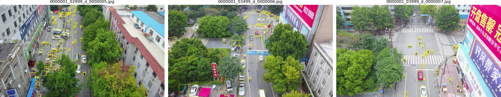

VisDrone[^visdrone] es un conjunto de referencia de imágenes captadas por cámaras montadas en drones, en entornos urbanos y suburbanos de catorce ciudades de China. La tarea de detección (DET) anota diez categorías: *pedestrian*, *people*, *bicycle*, *car*, *van*, *truck*, *tricycle*, *awning-tricycle*, *bus* y *motor*. Se utilizaron los archivos distribuidos por Ultralytics[^ul-visdrone], que replican los particionados oficiales: 6471 imágenes de entrenamiento, 548 de validación y 1610 de test-dev.

Las imágenes tienen una resolución nativa mayor que la entrada de la red: en validación y test-dev predominan 1400 × 788 y 1360 × 765 píxeles, y hay tomas de hasta 1920 × 1080. Las 548 imágenes de validación provienen de 76 secuencias, pero están separadas por cientos de cuadros: la misma persona casi nunca aparece dos veces, y las anotaciones no tienen identificador de objeto. Por eso este conjunto no permite medir la detección durante una pasada; para eso está [VisDrone-VID](visdrone-vid.md).

La conversión al formato YOLO mapea las categorías originales 1–10 a los índices 0–9 y excluye las demás. Las regiones marcadas con *score* 0 (zonas ignoradas) no se usan como etiquetas. La auditoría encontró una única caja inválida, de ancho 4 y alto 0, que se excluyó y quedó registrada. Todos los archivos originales se conservan junto con su hash SHA-256.

| Partición | Imágenes | Cajas convertidas | Cajas por imagen | Regiones score 0 |
|---|---:|---:|---:|---:|
| Entrenamiento | 6471 | 343 204 | 53,0 | 10 345 |
| Validación | 548 | 38 759 | 70,7 | 1410 |
| Test-dev | 1610 | 75 102 | 46,6 | 2445 |

Tabla: Conteos reales obtenidos por la auditoría de datos[^audit].

*Nota de uso.* Los datos se utilizan con fines académicos, según las condiciones publicadas por los autores de VisDrone. No se redistribuyen imágenes ni pesos fuera del equipo.

[^visdrone]: P. Zhu *et al.*, Detection and Tracking Meet Drones Challenge, IEEE TPAMI, 2022.
[^ul-visdrone]: Ultralytics, VisDrone Dataset.
[^audit]: `data/audit.json`, generado por `python -m tp4.cli prepare`.
