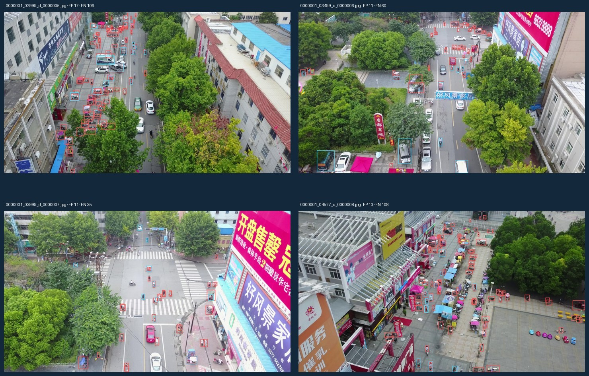

# Métricas globales

La tabla resume la evaluación de cada modelo sobre el conjunto de validación completo, junto con la latencia y el costo de entrenamiento[^analisis].

| Métrica (validación) | YOLO11n | YOLO26n | Δ (26 − 11) |
|---|---:|---:|---:|
| Precision | **41,88 %** | 40,41 % | −1,47 p. p. |
| Recall | 31,38 % | **31,77 %** | +0,39 p. p. |
| mAP50 | 28,41 % | **28,45 %** | +0,04 p. p. |
| mAP50–95 | **16,03 %** | 15,85 % | −0,18 p. p. |
| Latencia RTX 5070 (ms/imagen) | 26,59 | 26,74 | +0,15 |
| Tiempo total de ajuste (h) | 3,27 | 4,41 | +34,9 % |

Tabla: Evaluación de `best.pt` sobre validación (548 imágenes). Una ejecución por modelo; las diferencias no tienen significancia estadística establecida.

El rendimiento global es muy similar. YOLO11n muestra una ventaja descriptiva de 0,18 p. p. en mAP50–95 y YOLO26n una de 0,04 p. p. en mAP50. Con una sola semilla, ninguna de las dos diferencias permite afirmar que un modelo supere al otro.

La latencia en la laptop es prácticamente idéntica (unas 37 imágenes por segundo en ambos casos). Esta cifra *no* se puede extrapolar a una computadora de a bordo: allí cambian el hardware, el motor de inferencia y la precisión numérica.

YOLO26n requirió un 34,9 % más de tiempo de ajuste. Las vistas previas por época suman solo 10,3 s, por lo que no explican esa diferencia de unos 68 minutos. De todos modos, el costo de entrenamiento se paga una sola vez y fuera de línea, mientras que el costo de inferencia se paga en cada cuadro durante el vuelo.

# Resultados por clase

| Clase | AP50–95 YOLO11n | AP50–95 YOLO26n | Δ (p. p.) |
|---|---:|---:|---:|
| pedestrian | 12,28 % | 12,93 % | +0,65 |
| people | 7,14 % | 7,32 % | +0,17 |
| bicycle | 2,18 % | 2,20 % | +0,02 |
| car | 47,14 % | 46,23 % | −0,92 |
| van | 21,92 % | 21,53 % | −0,39 |
| truck | 17,73 % | 17,21 % | −0,52 |
| tricycle | 8,96 % | 9,59 % | +0,63 |
| awning-tricycle | 5,44 % | 5,23 % | −0,21 |
| bus | 25,28 % | 24,09 % | −1,19 |
| motor | 12,25 % | 12,22 % | −0,03 |

Tabla: AP50–95 por clase sobre validación.

*Car* es la clase más fuerte en ambos modelos (alrededor del 46–47 %): es un objeto relativamente grande y abundante. Las más débiles son *bicycle* (2,2 %), *awning-tricycle* (5,3 %) y *people* (7,2 %), todas pequeñas o visualmente ambiguas.

YOLO26n mejora levemente *pedestrian* y *tricycle*; YOLO11n obtiene más AP en *bus*, *car* y *truck*. Las mejoras para objetos pequeños que declara el fabricante de YOLO26 no se traducen, en este experimento, en una ganancia clara en las clases pequeñas: *bicycle* mejora 0,02 p. p. y *people*, 0,17 p. p.

# Evolución durante el ajuste

Las curvas crecen con fuerza durante las primeras épocas y se aplanan hacia las épocas 35–40. El máximo de mAP50–95 de YOLO11n aparece en la época 50 (16,28 %). El de YOLO26n aparece en la época 36 (16,19 %) y baja a 15,91 % en la 50, una caída leve que no alcanza para afirmar sobreajuste. Las magnitudes de la pérdida no se comparan entre arquitecturas, porque sus componentes difieren (DFL frente a L1).

Las cifras de las curvas provienen de las validaciones internas; la tabla de métricas globales usa la evaluación independiente de `best.pt`. No son exactamente iguales y la causa no está aislada, por lo que no se mezclan ambos protocolos.

# Análisis cualitativo de errores

En la muestra de 871 objetos, YOLO11n obtuvo TP = 263, FP = 192 y FN = 608, y YOLO26n obtuvo TP = 251, FP = 151 y FN = 620. Es decir, YOLO26n comete menos falsas alarmas pero omite algunos objetos más.

La inspección muestra que predominan las omisiones de personas y vehículos de dos ruedas en escenas densas, junto con falsas detecciones en vehículos estacionados y vegetación. Se trata de una observación cualitativa sobre escenas relacionadas, no de una muestra representativa. Aun así, coincide con el patrón por clase: el cuello de botella son los objetos pequeños.

# Discusión y elección del modelo para las placas

Los resultados muestran que **los dos modelos son equivalentes en precisión** para este problema, y que el techo actual lo imponen los objetos pequeños, no la arquitectura. En validación, YOLO11n es descriptivamente más favorable por mAP50–95 y costo de entrenamiento. Sin embargo, para un sistema embarcado importan otros factores:

1. **Posprocesamiento.** YOLO26n no requiere NMS. En escenas densas como las de VisDrone, el NMS procesa muchos candidatos y su costo recae en la CPU de la placa. Un modelo *end-to-end* simplifica la exportación y vuelve más predecible el tiempo por cuadro.
2. **Orientación a borde.** El fabricante diseñó YOLO26 para dispositivos de borde y declara mejoras de velocidad en CPU[^yolo26]. Esa afirmación es exactamente lo que el benchmark en placas debe verificar.
3. **Costo de entrenamiento.** La diferencia de tiempo de ajuste no influye en la operación del dron.

Por eso se eligió **YOLO26n** como modelo de referencia para el benchmark en placa. Se trata de una decisión fundada en el diseño del modelo, no en una superioridad medida; las [decisiones abiertas](../plan/decisiones.md) proponen incorporar YOLO11n como control para ponerla a prueba.

[^analisis]: `analysis/comparacion_yolo11_yolo26.md`, con los `run.json` de ambas ejecuciones.
[^yolo26]: Ultralytics, documentación de YOLO26.
