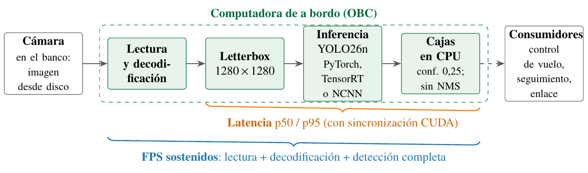

# Preguntas de investigación

1. ¿Cuánto acelera el motor optimizado (TensorRT FP16 o NCNN) respecto de PyTorch *en la misma placa*?
2. ¿Cuánta precisión se pierde al exportar y cambiar la precisión numérica (Δ mAP respecto del `.pt` en la misma placa)?
3. ¿Se sostiene el rendimiento durante cinco minutos continuos, o aparece limitación térmica (*throttling*)?
4. ¿Qué huella de memoria deja cada variante para el resto del software de a bordo?
5. Con GPU y sin GPU, ¿qué configuración satisface el requisito operativo y el [objetivo de detección por pasada](../mision/objetivo-deteccion-pasada.md)?

# Paquete común y reproducibilidad

Ambos equipos reciben **el mismo ZIP** (unos 61 MiB) con su archivo `.sha256`[^guia]. Contiene:

- 300 imágenes únicas de test-dev, elegidas sin reemplazo con semilla 42, junto con sus etiquetas y un orden fijo;
- el `best.pt` de YOLO26n [reentrenado](../experimentos/reentrenamiento-1280.md) con persona y vehículo a 1280 px (ejecución `20260928T003017Z`), con su manifiesto de entrenamiento (**no** debe reemplazarse por pesos descargados de Internet);
- doce imágenes de galería, la configuración y el SHA-256 de cada archivo;
- la evaluación de referencia en la laptop sobre esa misma muestra, a 1280 px y con las dos clases: **mAP50 = 57,52 %** y **mAP50–95 = 32,02 %** (persona 35,0 % y vehículo 80,0 % de AP50).

# Cadena medida

# Protocolo de medición

- **Repeticiones:** tres corridas de cinco minutos por modelo, cada una con 50 imágenes de calentamiento. El orden alterna entre PyTorch/optimizado, optimizado/PyTorch y PyTorch/optimizado, con pausas de 60 s entre procesos para limitar el sesgo térmico.
- **Aislamiento:** cada medición corre en un proceso nuevo que carga solo su variante. Nunca se exporta dentro del proceso medido.
- **Entrada:** una imagen por vez desde disco, lote 1, *letterbox* de 1280 px (la configuración por defecto de la misión), confianza 0,25 y un máximo de 300 detecciones. No se impone NMS a la salida *end-to-end* de YOLO26.
- **Memoria y telemetría:** RSS antes y después de cargar el modelo, y pico muestreado cada 200 ms, junto con temperaturas, frecuencias y estado de *throttling*. En Jetson la memoria es compartida, por lo que no deben sumarse contadores de CPU y GPU.
- **Condiciones:** misma fuente, refrigeración y modo de potencia para ambos modelos, registrados en cada ejecución. No se modifican `nvpmodel` ni los relojes entre mediciones.
- **Precisión:** tras las seis mediciones, procesos separados calculan mAP50, mAP50–95 y el desglose por clase (confianza 0,001) sobre las 300 imágenes, y generan los paneles anotados.

Los indicadores resultantes y su lectura están en [rendimiento en placa](../metricas/rendimiento-obc.md).

# Flujo de trabajo

# Estado de preparación

| Tarea | Estado |
|---|---:|
| Paquete de YOLO26n reentrenado a 1280 px generado (`package_20260928T020732595419Z`) y verificado por CRC y hashes; el código rechaza paquetes con otro checkpoint u otras clases | Hecho |
| Selección de las 300 imágenes reproducible con semilla 42 | Hecho |
| Referencia `.pt` en la laptop a 1280 px (mAP50 57,52 %; mAP50–95 32,02 %) | Hecho |
| Nueve pruebas automatizadas (integridad, checkpoint y clases, rutas, percentiles, rechazos, exclusión de diagnósticos, reporte) | Aprobadas |
| Inferencia real en CPU y anotación en Windows, marcadas como diagnóstico local | Hecho |
| Reporte HTML sin resultados abierto sin conexión de red | Hecho |
| Exportación TensorRT / NCNN y mediciones físicas en las placas | **Pendiente** |

Tabla: Validación local realizada el 26 de septiembre de 2026; paquete regenerado el 28. Ninguna cifra de la laptop se atribuye a las placas.

[^guia]: `BENCHMARK_OBC.md`, secciones 1 y 8.
