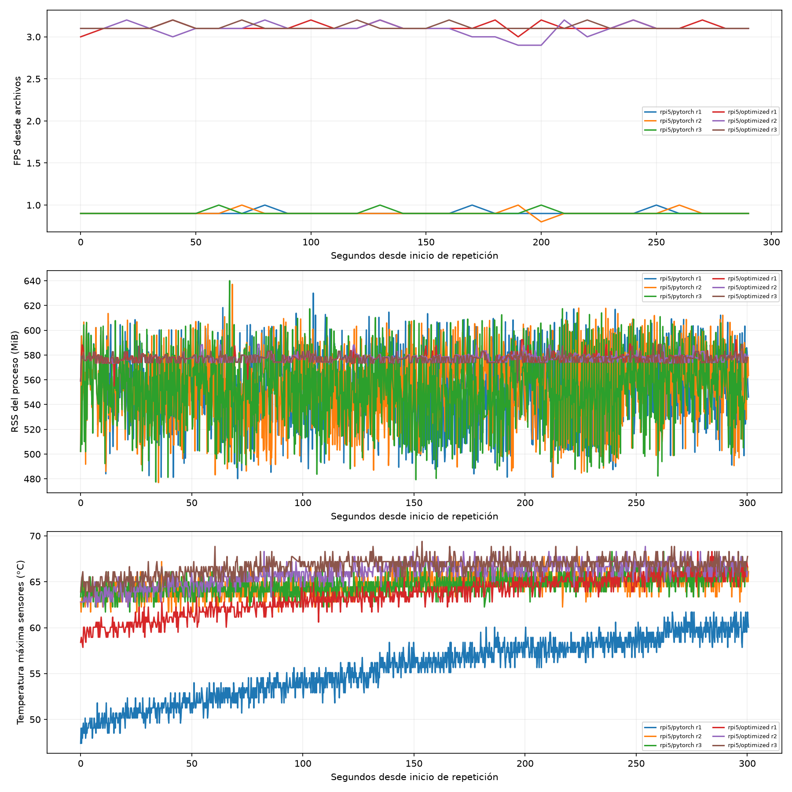

# Preguntas de investigación

1. ¿Cuánto acelera el motor optimizado (TensorRT FP16 o NCNN) respecto de PyTorch *en la misma placa*?
2. ¿Cuánta precisión se pierde al exportar y cambiar la precisión numérica (Δ mAP respecto del `.pt` en la misma placa)?
3. ¿Se sostiene el rendimiento durante cinco minutos continuos, o aparece limitación térmica (*throttling*)?
4. ¿Qué huella de memoria deja cada variante para el resto del software de a bordo?
5. Con GPU y sin GPU, ¿qué configuración satisface el requisito operativo y el [objetivo de detección por pasada](../mision/objetivo-deteccion-pasada.md)?

# Paquete común y reproducibilidad

Ambos equipos reciben **el mismo ZIP** (unos 61 MiB) con su archivo `.sha256`[^guia]. Contiene:

- 300 imágenes únicas de test-dev, elegidas sin reemplazo con semilla 42, junto con sus etiquetas y un orden fijo;
- el `best.pt` de YOLO26n [reentrenado](../experimentos/reentrenamiento-1280.md) con persona y vehículo a 1280 px (ejecución `20260928T003017Z`), con su manifiesto de entrenamiento (**no** debe reemplazarse por pesos descargados de Internet);
- doce imágenes de galería, la configuración y el SHA-256 de cada archivo;
- la evaluación de referencia en la laptop sobre esa misma muestra, a 1280 px y con las dos clases: **mAP50 = 57,52 %** y **mAP50–95 = 32,02 %** (persona 35,0 % y vehículo 80,0 % de AP50).

# Cadena medida

# Protocolo de medición

- **Repeticiones:** tres corridas de cinco minutos por modelo, cada una con 50 imágenes de calentamiento. El orden alterna entre PyTorch/optimizado, optimizado/PyTorch y PyTorch/optimizado, con pausas de 60 s entre procesos para limitar el sesgo térmico.
- **Aislamiento:** cada medición corre en un proceso nuevo que carga solo su variante. Nunca se exporta dentro del proceso medido.
- **Entrada:** una imagen por vez desde disco, lote 1, *letterbox* de 1280 px (la configuración por defecto de la misión), confianza 0,25 y un máximo de 300 detecciones. No se impone NMS a la salida *end-to-end* de YOLO26.
- **Memoria y telemetría:** RSS antes y después de cargar el modelo, y pico muestreado cada 200 ms, junto con temperaturas, frecuencias y estado de *throttling*. En Jetson la memoria es compartida, por lo que no deben sumarse contadores de CPU y GPU.
- **Condiciones:** misma fuente, refrigeración y modo de potencia para ambos modelos, registrados en cada ejecución. No se modifican `nvpmodel` ni los relojes entre mediciones.
- **Precisión:** tras las seis mediciones, procesos separados calculan mAP50, mAP50–95 y el desglose por clase (confianza 0,001) sobre las 300 imágenes, y generan los paneles anotados.

Los indicadores resultantes y su lectura están en [rendimiento en placa](../metricas/rendimiento-obc.md).

# Resultado en Raspberry Pi 5

El 28 de septiembre de 2026 se ejecutó el protocolo oficial sobre una Raspberry Pi 5 Model B de 8 GB, con fuente USB-C Power Delivery de 33 W y disipador con ventilador. Se usaron el commit `c1ed7e7` y el paquete `v0.0.1` (SHA-256 del ZIP `52e61d052a9063e0b611605eda1e879a061bc53047ef62f806cc5b1c227a1b2f`). La referencia fue PyTorch 2.14.0+cpu; el optimizado, NCNN 1.0.20260526 con cuatro hilos. Ambas variantes completaron tres corridas de cinco minutos y la evaluación de las 300 imágenes[^resultado-rpi5].

| Variante | FPS sostenidos | Latencia p50 / p95 (ms) | Pico RSS (MiB) | mAP50 (%) | mAP50–95 (%) |
|---|---:|---:|---:|---:|---:|
| PyTorch FP32/CPU | 0,911 | 1084,8 / 1115,7 | 640,1 | 57,50 | 32,00 |
| NCNN/CPU | 3,110 | 310,5 / 324,8 | 592,4 | 57,41 | 31,72 |

Tabla: Promedio de FPS y latencias de las tres repeticiones; RSS es el mayor pico muestreado por variante. La [tabla CSV](../../analysis/benchmark_rpi5.csv) conserva más cifras.

NCNN aceleró **3,41 veces** la inferencia completa y redujo el pico RSS en **7,45 %**. Frente al `.pt` en la misma placa, perdió **0,276 puntos porcentuales de mAP50–95**. La temperatura máxima muestreada fue **69,4 °C** y `vcgencmd get_throttled` quedó en `0x0` en todas las mediciones. Ninguna variante alcanzó los **5 FPS** del [objetivo operativo](../mision/objetivo-deteccion-pasada.md); los porcentajes de detección por pasada simulados a 5 FPS no describen el rendimiento real de esta Pi.

El mAP corresponde a esta muestra fija de test-dev, no al evaluador oficial de VisDrone. Una imagen contiene 333 objetos, por encima de `max_det=300`; el mismo límite se aplicó a ambas variantes y a la referencia del paquete. La [release v0.0.2-rpi5](https://github.com/alanblanco3223/tp4-visdrone-yolo/releases/tag/v0.0.2-rpi5) contiene el ZIP completo con los 600 paneles anotados y el informe HTML; el [resultado JSON](../../analysis/benchmark_rpi5_result.json) y las [versiones de Python](../../analysis/benchmark_rpi5_requirements.txt) quedan versionados.

# Flujo de trabajo

# Estado de preparación

| Tarea | Estado |
|---|---:|
| Paquete de YOLO26n reentrenado a 1280 px generado (`package_20260928T020732595419Z`) y verificado por CRC y hashes; el código rechaza paquetes con otro checkpoint u otras clases | Hecho |
| Selección de las 300 imágenes reproducible con semilla 42 | Hecho |
| Referencia `.pt` en la laptop a 1280 px (mAP50 57,52 %; mAP50–95 32,02 %) | Hecho |
| Diez pruebas automatizadas (integridad, checkpoint y clases, rutas, percentiles, ventanas, rechazos, exclusión de diagnósticos, reporte) | Aprobadas |
| Inferencia real en CPU y anotación en Windows, marcadas como diagnóstico local | Hecho |
| Reporte HTML sin resultados abierto sin conexión de red | Hecho |
| Exportación NCNN y seis mediciones oficiales en Raspberry Pi 5 | Hecho el 28 de septiembre de 2026 |
| Exportación TensorRT y mediciones físicas en Jetson | **Pendiente** |

Tabla: Preparación local realizada el 26 de septiembre de 2026, paquete regenerado el 28 y medición real en Raspberry Pi 5 el 28. Ninguna cifra de la laptop se atribuye a las placas.

[^guia]: `BENCHMARK_OBC.md`, secciones 1 y 8.
[^resultado-rpi5]: `analysis/benchmark_rpi5_result.json`, corrida oficial `rpi5_official_20260928T183223829895Z`.
